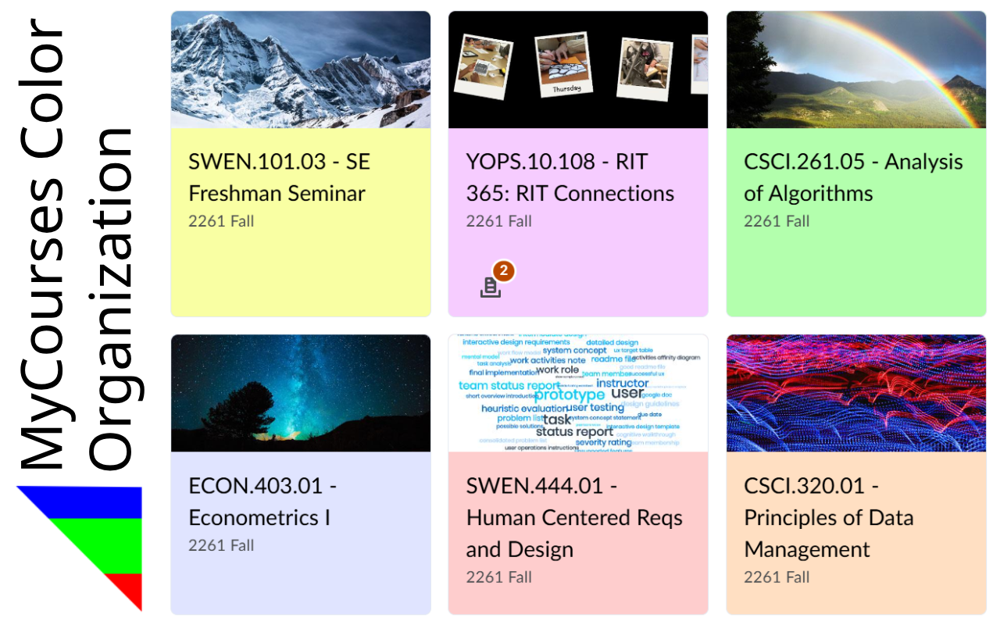
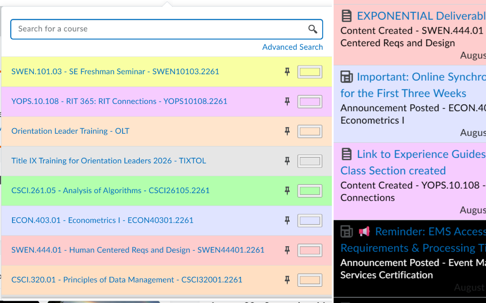
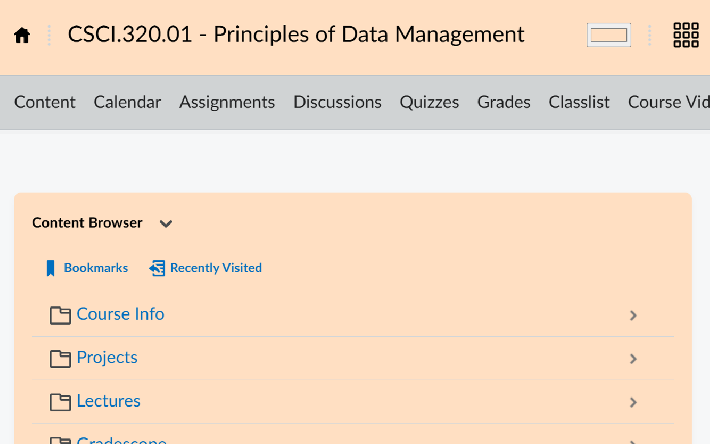

# MyCourses Color Organization

Allows you to assign colors to RIT's MyCourses website.

This extension gives you the ability to customize the colors of courses at [https://mycourses.rit.edu/](https://mycourses.rit.edu). The colors are applied in a multitude of places, which can be configured in the extension's settings. You can export the colors as a json file to syncronize them across devices.

## Installing the extension

The extension can be found [here for Chrome](https://chromewebstore.google.com/detail/my-courses-color-organiza/ebpcoafnjjigafbnhlgbdihikbomiain) and [here for Firefox](https://addons.mozilla.org/en-US/firefox/addon/my-courses-color-organization/).

## Running from source

### Chrome

1. Clone this repository
1. Go to [chrome://extensions/](chrome://extensions/)
1. **MAKE SURE YOU ARE IN DEVELOPER MODE**
1. Click "Load Unpacked"
1. Select the cloned repository

### Firefox

1. Clone this repository
1. Go to [about:debugging](about:debugging)
1. Click "Load Temporary Add-on..."
1. Select the manifest.json file in the cloned repository

